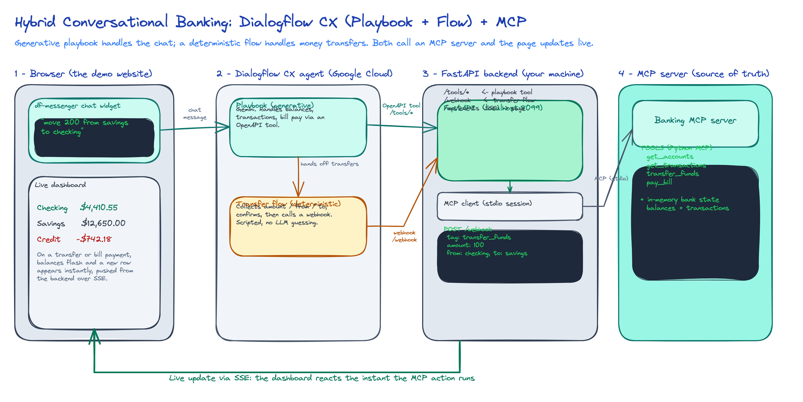

# Banking Dialogflow: Hybrid Conversational Agent + MCP

A demo conversational banking assistant that shows how a **Dialogflow CX** agent can drive a **real backend action through MCP** and have the result appear **live on a web page**.

You chat with a banking assistant on a website. When you ask it to do something (check a balance, move money, pay a bill), the agent calls a backend, the backend runs the action through an **MCP server**, and the dashboard on the same page updates instantly.

It is a **hybrid** agent: a generative **Playbook** handles the natural conversation, and a deterministic **Flow** handles the sensitive money transfer.



## What it demonstrates

- A generative **Playbook** (Gemini) that understands free text and calls tools.
- A deterministic **Flow** that collects and confirms a transfer step by step.
- An **MCP server** exposing the banking actions as reusable tools.
- A **live dashboard** that reacts the instant an action runs (Server-Sent Events).
- Both the Playbook and the Flow calling the same backend, which is the same MCP server underneath.

## How it works

| You ask for | Handled by | Reaches the backend via |
| --- | --- | --- |
| Balances, transactions, pay a bill | Playbook (generative) | OpenAPI **Tool** to `/tools/*` |
| Transfer money | Flow (deterministic) | **Webhook** (tag `transfer_funds`) to `/webhook` |

Dialogflow does not speak MCP directly. The **FastAPI backend is the bridge**: it receives the tool/webhook call over HTTPS, then acts as an **MCP client** that calls the **MCP server** where the banking logic and state live.

## Tech stack

- **Frontend**: one static page (dashboard + Dialogflow Messenger chat widget), live updates via SSE.
- **Backend**: FastAPI (serves the page, the `/tools/*` endpoints, the `/webhook`, and the SSE stream).
- **MCP**: Python MCP server (`get_accounts`, `get_transactions`, `transfer_funds`, `pay_bill`) with in-memory bank state.
- **Agent**: Dialogflow CX (Conversational Agents), Playbook + Flow, Gemini 2.5 Flash.
- **Tunnel**: ngrok, so Dialogflow (cloud) can reach the local backend.

## Repository structure

```
backend/
  app.py          FastAPI: serves the site, /tools/*, /webhook, SSE
  mcp_server.py   MCP server: the 4 banking tools + in-memory state
  mcp_client.py   Holds the MCP session for the backend
frontend/
  index.html      Dashboard + chat widget
  app.js          Rendering, live SSE updates, local demo controls
  styles.css      Styling (dashboard + chat widget theme)
  config.js       Your Dialogflow project-id / agent-id go here
dialogflow/
  openapi-tools.yaml     The OpenAPI schema for the Playbook Tool
  architecture.png       The architecture diagram
SETUP.md      Full step-by-step: run locally, expose with ngrok, build the Dialogflow agent
requirements.txt, Dockerfile, .env.example
```

---

## Run it locally

### Prerequisites

- **Python 3.11 or 3.12** (not 3.14, some dependencies have no prebuilt wheels for it yet).
- **ngrok** (`brew install ngrok`) with a free account and authtoken set.
- A Google Cloud project with billing enabled and a Dialogflow CX agent (see `SETUP.md`).

### 1. Start the backend and website (terminal 1)

```bash
python3.12 -m venv .venv
source .venv/bin/activate
pip install -r requirements.txt
uvicorn backend.app:app --port 8099
```

Open http://localhost:8099

The FastAPI process serves everything: the page, the API, the webhook, and the live updates. Port 8099 is used because 8080 is often taken (Docker, etc.); change it with `--port` if you like.

> Before wiring the real agent, the page shows a **Local demo** panel with buttons that trigger the MCP actions, so you can see the live dashboard update without Dialogflow.

### 2. Expose the backend with ngrok (terminal 2)

```bash
ngrok http 8099
```

Copy the `https://....ngrok-free.app` URL it prints. This is what Dialogflow will call.

### 3. Connect Dialogflow

Follow **`SETUP.md`**. In short: build the agent, point its Webhook and Tool at your ngrok URL, and put your `project-id` / `agent-id` in `frontend/config.js`. Then reload the page and the real chat widget appears.

---

## Try it 

With everything running, chat with the widget on the page:

- **"what's my balance"** lists the accounts (generative Playbook, calls the tool).
- **"transfer 100 from checking to savings"** then follow the prompts and confirm (deterministic Flow), watch the balances flash and a new row appear.
- **"pay 40 to the water company"** pays a bill, checking drops, new row appears.
- **"transfer 1,000,000 from checking to savings"** is rejected with "insufficient funds", proof it calls a real tool with real validation.

---

## Important notes

- **ngrok URL changes on restart** (free tier). If you restart ngrok, update the new URL in **two** places in Dialogflow: the Webhook URL (ending in `/webhook`) and the Tool's `servers.url` (base, no `/webhook`). See `SETUP.md`.
- **Turn off VPN / TLS inspection (e.g. Zscaler)** while running ngrok; TLS interception breaks ngrok's connection.
- **State is in-memory**: restarting the backend resets balances to the starting values. Swap the dicts in `backend/mcp_server.py` for a real datastore to go beyond a prototype.

